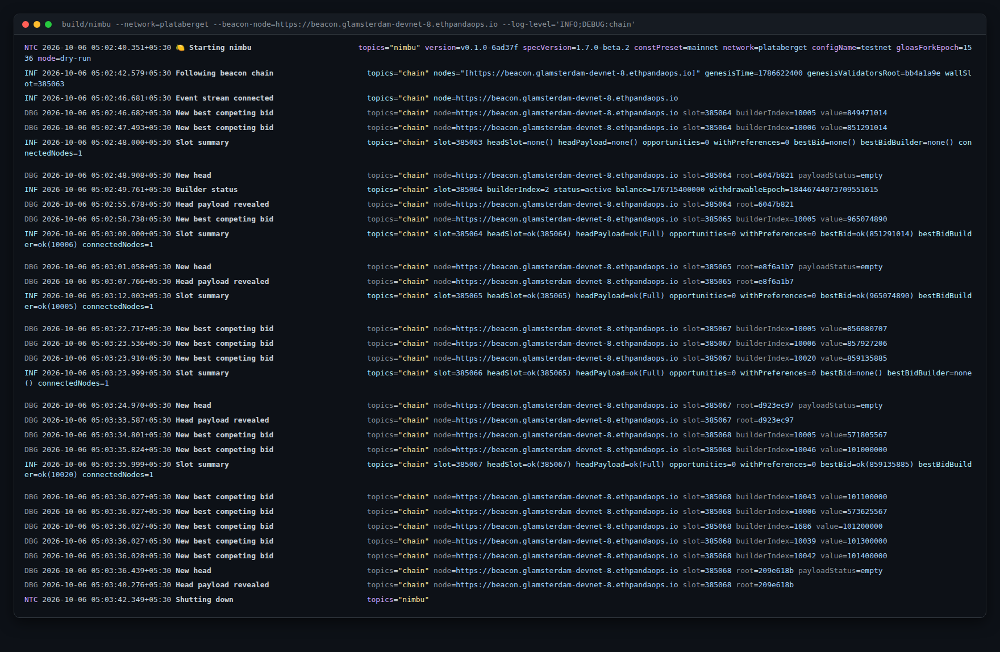

# 🍋 nimbu

An external **Gloas (EIP-7732 / ePBS) payload builder** in Nim, built on
[nimbus-eth2](https://github.com/status-im/nimbus-eth2).

> [!WARNING]
> **Work in progress.** nimbu does not build or bid on payloads yet, and the
> Gloas specs it targets are still pre-release. Do not run it against a
> network with real funds.

## What it will do

nimbu follows the beacon chain through one or more beacon nodes and builds
execution payloads through the engine API. It publishes signed
`ExecutionPayloadBid`s to proposers and reveals the
`SignedExecutionPayloadEnvelope` when one of its bids is included. The full
design is in [notes/0001-architecture-flow.md](notes/0001-architecture-flow.md).

## Status: following a live Gloas devnet

The dry run follows the chain and logs what a builder would see. It does
not build, sign or send anything yet.

**Running it on glamsterdam-devnet-8** (nimbus-eth2 knows this devnet as
`plataberget`):

```sh
make -j$(nproc) nimbu
build/nimbu --network=plataberget \
  --beacon-node=https://beacon.glamsterdam-devnet-8.ethpandaops.io \
  --log-level='INFO;DEBUG:chain'
```

Add `--builder-pubkey=0x…` to also track a builder's index, balance and
status every epoch.



## Building

You need a C compiler, GNU Make, Git and Git LFS.

```sh
make -j$(nproc) update        # submodules + pinned Nim compiler
make -j$(nproc) nimbu         # → build/nimbu
make -j$(nproc) test
```

## Notes

Every design decision, spec interpretation and open question lives in
[`notes/`](notes/README.md).

## License

Licensed under either of [MIT](LICENSE-MIT) or
[Apache 2.0](LICENSE-APACHEv2), at your option.
