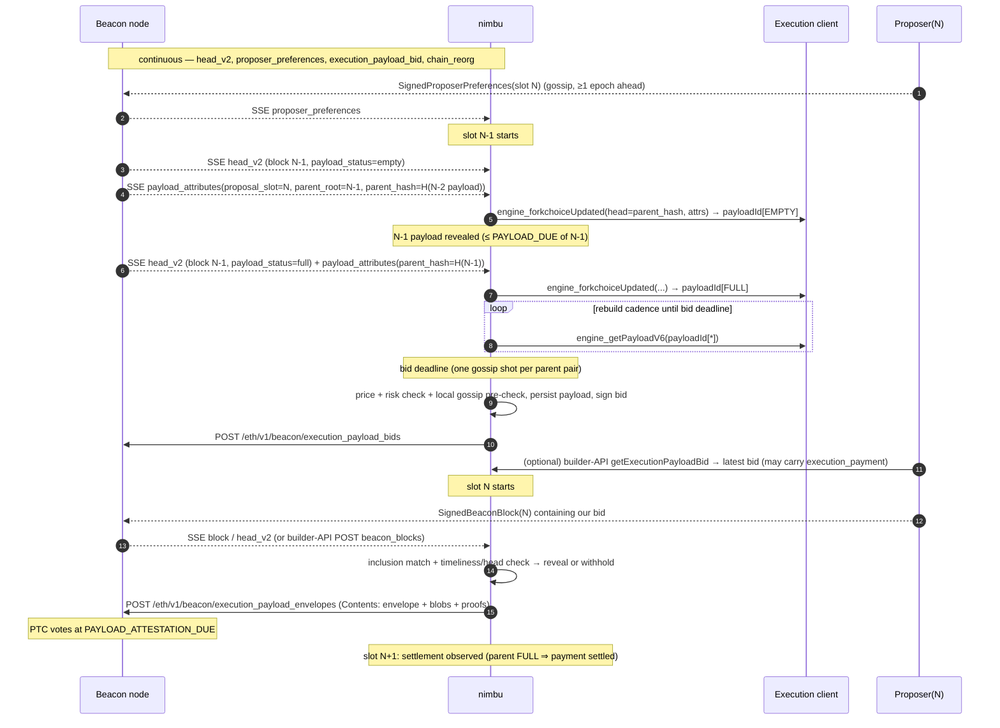

# 0001 — Architecture flow

Status: draft v0 · Last reviewed: 2026-10-06

This note describes the end-to-end architecture of **nimbu**, an external
Gloas (EIP-7732 / ePBS) payload builder written in Nim on top of
`nimbus-eth2`. Spec details live in [0002](0002-gloas-spec-digest.md); what we
reuse from nimbus-eth2 lives in [0003](0003-nimbus-eth2-reuse.md).

## 1. Scope

In scope for v0:

- Follow the beacon chain and proposer preferences.
- Build execution payloads for upcoming slots through the engine API.
- Price, sign and publish `SignedExecutionPayloadBid`s:
  - the trustless p2p path, by posting to a beacon node;
  - the builder-API pull path, by serving builder-specs Gloas endpoints.
- Detect when one of our bids is included, then reveal the payload or
  withhold it honestly. Revealing means publishing
  `SignedExecutionPayloadEnvelopeContents`, i.e. the envelope plus its blobs
  and proofs.
- Track exposure (bids that may become payments) against our builder balance.
- Lifecycle tooling to produce a builder deposit request and to explain how to
  exit.

Out of scope for v0. These have extension points but no implementation:

- MEV search and ordering inside the payload: bundle ingestion, simulation and
  merging. v0 uses the EL's own `engine_getPayloadV6` output. The
  `PayloadSource` abstraction (§4.4) is where a real MEV engine plugs in.
- Our own libp2p node. v0 talks to one or more trusted beacon nodes over REST
  and SSE (see decision D1 in [0005](0005-decisions-and-open-questions.md)).
- Heze / FOCIL inclusion-list constraints.

## 2. Topology

```
                         ┌──────────────────────────── nimbu ────────────────────────────┐
                         │                                                                │
 ┌──────────────┐  SSE   │  ┌──────────────┐   ┌───────────────┐   ┌──────────────────┐   │
 │ Beacon node  │───────▶│  │ ChainFollower│──▶│ BuildScheduler│──▶│ PayloadSource(s) │◀──┼──▶ EL (engine API, JWT)
 │ (nimbus, ≥1) │  REST  │  └──────┬───────┘   └───────┬───────┘   └────────┬─────────┘   │      fcU / getPayloadV6
 │              │◀──────▶│         │                   │                    │             │
 └──────▲───────┘        │  ┌──────▼───────┐   ┌───────▼───────┐   ┌────────▼─────────┐   │
        │ gossip         │  │ PrefsCache   │   │ BidEngine     │◀──│ PayloadStore     │   │
        │                │  │ BidObserver  │──▶│ (strategy +   │   │ (WAL on disk)    │   │
        │                │  │ BuilderView  │   │  risk ledger) │   └────────▲─────────┘   │
        │                │  └──────────────┘   └───────┬───────┘            │             │
        │                │                             │ sign               │             │
        │                │                     ┌───────▼───────┐   ┌────────┴─────────┐   │
        └────────────────┼─────────────────────│ Publisher     │◀──│ RevealManager    │   │
          POST bids /    │                     └───────────────┘   └────────▲─────────┘   │
          envelopes      │                     ┌───────────────┐            │             │
 Proposer BN ───────────▶│                     │BuilderApiSrv  │────────────┘             │
 (builder-specs HTTP)    │                     └───────────────┘                          │
                         │  Signer (local keystore | remote)  · Metrics · Admin/CLI       │
                         └────────────────────────────────────────────────────────────────┘
```

Trust boundaries:

- **Beacon node(s): trusted.** We use their fork-choice view, and their
  gossip validation acts as a pre-flight check.
- **EL: trusted.** It owns the mempool and does the block building.
- **Proposer beacon nodes calling our builder API: untrusted.** We
  authenticate them with `SignedBuilderRequestAuth` and rate-limit them.

## 3. Slot lifecycle

Let `N` be the slot we bid for. Times are given as offsets into a slot in
basis points (BPS) of `SLOT_DURATION_MS`. Take them from the runtime config;
never hard-code them.



### 3.1 Phase A — Continuous chain following

`ChainFollower` keeps one SSE subscription per configured beacon node. It
listens to `head_v2`, `payload_attributes`, `proposer_preferences`,
`execution_payload_bid`, `block`, `execution_payload`,
`execution_payload_available`, `chain_reorg` and `finalized_checkpoint`.
On each event it:

- Updates the **head view**: `(root, slot, payload_status, dependent roots)`.
- Inserts into **`PrefsCache`**, keyed by `(proposal_slot, dependent_root)`.
  The first entry seen wins, matching the gossip `Seen` rule.
- Inserts into **`BidObserver`**, which keeps the best competing value per
  `(slot, parent_hash, parent_root)` and feeds the strategy.
- Refreshes **`BuilderView`** once per epoch and on any relevant event. This
  is our `builder_index`, `balance`, `deposit_epoch`, `withdrawable_epoch` and
  activity status, via `POST /eth/v1/beacon/states/head/builders`.

When several beacon nodes are configured, there are two ways to combine them:

- *Head-of-line:* the first event for a key wins. All events are
  deduplicated by key.
- *Majority:* deferred to a later version.

### 3.2 Phase B — Build scheduling (slot N−1)

A `payload_attributes` event for `proposal_slot = N` creates or updates a
**`BuildJob`** keyed by `(N, parent_block_root, parent_block_hash)`.

- One job exists per **parent pair**. Typically there are two per slot:
  - **EMPTY:** the parent payload is unknown or not yet revealed.
  - **FULL:** the parent payload was revealed.

  A job may also build on the head's parent, which anticipates a proposer
  re-org. This follows `is_bid_compatible_with_head`.
- A job is only started if `PrefsCache` has preferences for
  `(N, dependent_root(parent_block_root, epoch(N)))`. With no preferences the
  proposer accepts no trustless bids. The builder-API path still applies.
- The job derives its `PayloadAttributesV4` as follows:
  - `timestamp`, `prev_randao`, `withdrawals`, `parent_beacon_block_root`
    and `slot_number` come from the event.
  - `suggested_fee_recipient` is **our** coinbase.
  - `target_gas_limit` comes from the preferences.
- It calls `engine_forkchoiceUpdated` and then polls `engine_getPayloadV6` at
  a configured cadence. Every response is kept as a candidate in the job.

### 3.3 Phase C — Pricing and bidding (late N−1 / early N)

For each job, at its **bid deadline**:

1. **Pick a candidate.** Choose the latest `getPayload` response that passes
   the *local pre-checks* in [0002 §5](0002-gloas-spec-digest.md#5-gossip-rules-that-constrain-bidding-execution_payload_bid):
   - gas limit compatibility;
   - blob count;
   - `block_hash != parent_hash`;
   - known parent payload;
   - fee recipient match.
2. **Price.** `BidEngine.price(job, candidate, competition)` returns the
   value in gwei. Pricing is a pluggable `BidStrategy`; v0 ships
   `fixedMargin` and `beatBestSeen`.
3. **Risk gate.** The `RiskLedger` checks that the price is within its
   ceiling (§7). If it is not, clamp the price or skip the bid.
4. **Persist first.** Write the `ExecutionPayload`, `BlobsBundle` and
   `ExecutionRequests` to the `PayloadStore` WAL, then `fsync`. Losing a
   payload after its bid is included means paying without revealing.
5. **Sign.** Build `ExecutionPayloadBid` and sign it with
   `get_execution_payload_bid_signature(fork, gvr, epoch(bid.slot), …)`.
6. **Publish.** POST to every configured beacon node. A 200 means the bid
   passed gossip validation on that node. Record it in the `RiskLedger` as
   *exposure*.

The bid deadline is the main tuning knob. It exists because gossip accepts
only **one bid per builder per parent pair**. Bidding earlier helps the bid
propagate; bidding later lets the payload accumulate more value. It is
configured as a BPS offset relative to slot N's start, and may be negative.

**Builder-API path:**
- *When a proposer's BN calls us:* `BuilderApiServer.getExecutionPayloadBid`
  returns the best candidate on demand, priced at that moment. It has no
  one-shot restriction and may set `execution_payment` up to that proposer's
  stored `max_execution_payment` cap. Both the
  persist-before-respond rule and the exposure accounting apply.
- *If the proposer has stored `max_execution_payment`:* the BN posts it
  to us via `submitBuilderPreferences`; we keep it in the `PrefsCache`
  alongside its p2p preferences.

### 3.4 Phase D — Inclusion, reveal or withhold (slot N)

`RevealManager` learns about block N from whichever arrives first:

- the SSE `block` event followed by `GET /eth/v2/beacon/blocks/{root}`;
- a builder-API push to `POST /eth/v1/builder/beacon_blocks`.

The SSE route is mandatory: a nimbus beacon node does **not** push the block
to us when the proposer's validators run inside it.

1. **Match.** Check that `block.body.signed_execution_payload_bid.message.builder_index == ours`.
   Look up the payload by `block_hash`. If the bid is ours but the payload is
   missing, raise a `critical` alert and count it in a metric.
2. **Decide** (honest withholding policy):
   - *Reveal* if block N is timely and is the BN's head (`head_v2.slot == N`,
     same root) before the reveal deadline.
   - *Withhold* if block N is not on our head chain by the deadline.
   - Log every decision with its reason; this has to be auditable.
3. **Build the envelope.**
   `ExecutionPayloadEnvelope{payload, execution_requests, builder_index, beacon_block_root = htr(block), parent_beacon_block_root = block.parent_root}`.
   Sign it with the envelope helper, using the epoch of `payload.slot_number`.
4. **Publish.** POST `SignedExecutionPayloadEnvelopeContents` with
   `Eth-Blob-Data-Included: true` and
   `broadcast_validation=consensus_and_equivocation` to every beacon node
   **that has already imported block N**, meaning that BN has emitted its own
   `block` event. A nimbus BN drops the blobs if the block is unknown; see
   Q4 in [0005](0005-decisions-and-open-questions.md). The BN derives and gossips the data column sidecars. The target
   is ≤ `reveal_target_bps` (default ≈ 3500 BPS ≈ 4.2 s), well before
   `PAYLOAD_DUE_BPS` (5000).

### 3.5 Phase E — Settlement and cleanup (slot N+1 …)

- **Observe the next block's `bid.parent_block_hash`.** If it equals our
  `block_hash`, the payload became canonical as FULL and the payment is
  settled into `builder_pending_withdrawals`.
- **If EMPTY, the payment may still settle** at the epoch boundary via the
  attestation quorum. Model it as *pending* until the epoch after next, then
  re-read the balance from `BuilderView`.
- **Release exposure** for losing bids once slot N is past and block N does
  not carry our bid.
- **Prune** `PayloadStore` entries older than `retention_slots`.

## 4. Components

Module paths are relative to the `nimbu/` source dir. They mirror
nimbus-eth2's layout style; see [0004](0004-repo-layout-and-vendoring.md).

### 4.1 `ChainFollower` (`nimbu/chain/chain_follower.nim`)

- **Does:** owns the REST clients and SSE streams, reconnects with backoff,
  turns events into typed messages for the components below, and runs the
  slot clock (`BeaconClock` from genesis).
- **Exposes:** `onHead`, `onPayloadAttributes`, `onPreferences`, `onBid`,
  `onBlock` and `onReorg` callback hooks. These are plain closures; there is
  no global event bus.

### 4.2 `PrefsCache`, `BidObserver`, `BuilderView` (`nimbu/chain/*.nim`)

These are small in-memory caches, pruned by slot. As built in M1:

- **`ChainViewRef`** (`chain_view.nim`) is the pure, I/O-free state that
  `ChainFollower` feeds. It holds:
  - the `HeadTracker` (`head_tracker.nim`);
  - `PrefsCache` (`prefs_cache.nim`);
  - `BidObserver` (`bid_observer.nim`);
  - one `BuildOpportunity` per `payload_attributes` event.
- **Bounded memory.** All caches are `minilru` LRUs and are pruned two slots
  back.
- **Decoding.** Events are decoded by `chain_events.nim`. Large payloads are
  decoded once into refs and shared, not copied (0006 §6).
- **`BuilderViewRef`** (`builder_view.nim`) calls
  `POST /eth/v1/beacon/states/head/builders` with our public key once per
  epoch. Missing support for the endpoint is detected and reported, never
  fatal.

### 4.3 `BuildScheduler` / `BuildJob` (`nimbu/building/*.nim`)

- **Does:** keeps one job per parent pair and a per-job async loop of
  `getPayload`; it cancels jobs on reorg or once the slot is past.
- **Limits:** concurrency is bounded by config (`max_jobs_per_slot`).
- **Note:** the EMPTY and FULL jobs share an EL, so `forkchoiceUpdated` must
  not move the EL's canonical head unexpectedly. Use the head the BN gives in
  `payload_attributes`; see the open question about EL head interference in
  [0005](0005-decisions-and-open-questions.md).

### 4.4 `PayloadSource` (`nimbu/building/payload_source.nim`)

This is an abstraction over where payloads come from:

```nim
type
  PayloadSourceKind* {.pure.} = enum
    EngineApi      ## stock EL via engine_getPayloadV6 (v0)
    External       ## MEV block-building engine (future)

  PayloadCandidate* = object
    payload*: gloas.ExecutionPayload
    blobsBundle*: fulu.BlobsBundle
    executionRequests*: seq[seq[byte]]
    blockValue*: UInt256        ## wei, as reported by the source
    receivedAt*: Moment
```

v0 wraps nimbus-eth2's `ELManager` (`forkchoiceUpdated`, `getPayload`). A MEV
engine later implements the same interface.

### 4.5 `BidEngine` + `RiskLedger` (`nimbu/bidding/*.nim`)

- **`BidStrategy`:** a pure function of `(candidate, competition, prefs,
  config)` returning `Opt[Gwei]`. It has no side effects, so it is
  unit-testable.
- **`RiskLedger`:** see §7.
- **`bid_factory`:** assembles `ExecutionPayloadBid` from the job and the
  candidate, then runs the local pre-checks.

### 4.6 `Signer` (`nimbu/signing/builder_signer.nim`)

- **Local:** a keystore decrypted at startup with nimbus-eth2
  `spec/keystore.decryptKeystore`.
- **Remote (Web3Signer):** nimbus-eth2's `Web3SignerRequestKind` has
  envelope and request-auth kinds but **no bid kind**. v0 is local-only;
  see the open question on remote signing in
  [0005](0005-decisions-and-open-questions.md).
- **Signs:** bids, envelopes, `SignedBuilderRequestAuth` verification, and
  builder deposit messages.

### 4.7 `Publisher` (`nimbu/publishing/publisher.nim`)

- **Fan-out:** sends each message to N beacon nodes in parallel, returns
  after the first success, and records per-BN latency and status in metrics.
- **Bids:** nimbus-eth2 has **no** REST client call for
  `POST /eth/v1/beacon/execution_payload_bids`. We add one in nimbu
  (`nimbu/rest/rest_builder_calls.nim`) using the same `{.rest.}` pragma and
  propose it upstream.

### 4.8 `RevealManager` (`nimbu/publishing/reveal_manager.nim`)

Implements Phase D. Its single entry point, `onBlockSeen`, is idempotent:
the SSE event and the builder-API push may both arrive, and the envelope must
be published only once.

### 4.9 `PayloadStore` (`nimbu/building/payload_store.nim`)

- **Index:** keyed by `block_hash`, with a secondary index
  `(slot, parent pair)`.
- **Storage:** an in-memory map plus an append-only WAL in the data dir,
  SSZ-encoded. The WAL is replayed on start for slots ≥ current − 1.

### 4.10 `BuilderApiServer` (`nimbu/api/builder_api.nim`)

- **Implementation:** a presto `RestRouter` serving the builder-specs Gloas
  routes:
  - `execution_payload_bid`
  - `builder_preferences`
  - `beacon_blocks`
  - `status`
- **Request rules:**
  - verify `SignedBuilderRequestAuth`, and check its `data` against our
    configured auth data;
  - honour `X-Timeout-Ms`;
  - support JSON and SSZ.
- **Reuse:** the types come from nimbus-eth2 `spec/mev/gloas_mev.nim`, and
  the request/response shapes mirror `spec/mev/rest_mev_calls.nim`, which is
  the client side.

### 4.11 Ops (`nimbu/nimbu.nim`, `nimbu/conf.nim`, `nimbu/tools/*`)

- **Config:** confutils `NimbuConf` covering:
  - BN URLs, EL URLs + JWT and the keystore;
  - coinbase, auth data, timing BPS knobs and the strategy;
  - risk limits, data dir, REST/metrics ports.
- **Observability:** chronicles logging and a nim-metrics Prometheus endpoint.
- **Subcommands:**
  - `run` (default);
  - `deposit-data`: emits a `BuilderDepositRequest` with its proof of
    possession, for submission to the EIP-8282 contract;
  - `status`.

## 5. Concurrency model

- **Single-threaded event loop.** Everything runs as chronos async on one
  thread, as in nimbus-eth2. BLS signing is fast enough inline; KZG work is
  not ours, because the EL returns proofs and the BN computes the columns.
- **No blocking I/O on the event loop.** The WAL uses a buffered file and
  `fsync` per write (a few KB to about 1 MB). If profiling shows stalls, move
  it to a `taskpools` worker.
- **Per-slot work is cancellable.** Every job keeps a `Future` handle, and a
  reorg or a passed slot cancels it via `cancelAndWait`.

## 6. Timing knobs (defaults are starting points; tune on devnets)

| Knob                    | Default (BPS of slot)  | Meaning                                             |
| ----------------------- | ---------------------- | --------------------------------------------------- |
| `rebuild_interval_ms`   | 250 ms                 | `getPayload` polling cadence per job                |
| `bid_deadline_bps`      | −1500 (rel. to slot N) | When the one-shot gossip bid is sent (≈ 1.8 s before N) |
| `reveal_target_bps`     | 3500                   | Latest time we aim to have the envelope POSTed     |
| `reveal_cutoff_bps`     | 4800                   | Past this, withhold (it can't reach PTC in time)   |
| `api_response_margin_ms`| 50 ms                  | Safety margin under `X-Timeout-Ms`                  |

## 7. Risk & accounting

These are the funds the builder can lose:

1. **A bid is included but the payload is withheld or late, and the block
   still reaches attestation quorum.** We pay `value` and earn nothing.
2. **Several bids are included across slots** before the earlier ones settle.

The `RiskLedger` keeps:

- `onchainBalance`, from `BuilderView`;
- `pendingKnown`: our bids that were included in blocks and are not yet
  settled or expired;
- `inflight`: bids published for slots ≥ now that may still be included.

It enforces:

- `value ≤ onchainBalance − MIN_DEPOSIT_AMOUNT − pendingKnown − inflight_other_slots`,
  which mirrors `can_builder_cover_bid` conservatively;
- `value ≤ max_bid_gwei` and `value ≤ blockValue − min_margin` (config);
- a daily loss budget. Once it is reached, the ledger stops bidding and
  raises an alert.

Within one slot, the EMPTY and FULL bids can't both be included because a
block has a single parent, so their exposure is a `max`, not a sum. Bids
across different slots do add up.

Exact `pending withdrawals` need the beacon state; the REST builder record
only has the balance. See the open question on balance accounting in
[0005](0005-decisions-and-open-questions.md).

## 8. Failure modes

| Failure                               | Behaviour                                                      |
| ------------------------------------- | -------------------------------------------------------------- |
| BN SSE disconnect                     | Reconnect with backoff; pause bidding until `head_v2` resyncs  |
| All BNs down                          | No bids. Reveal attempts keep retrying until `reveal_cutoff`   |
| EL slow/down                          | Job yields no candidate → no bid for that pair                 |
| Bid POST 400 (gossip reject)          | Log the reason, count it in a metric, never retry the same pair (one-shot) |
| Payload missing at reveal             | `critical` log + metric; cannot recover (we pay if quorum)     |
| Crash between bid and reveal          | WAL replay restores payloads; RevealManager re-scans head      |
| Reorg after reveal                    | Nothing to do; settlement tracking follows the new chain       |

## 9. Testing strategy

- **Unit tests** (`tests/test_*.nim`, unittest2):
  - strategies, `RiskLedger`, the bid factory pre-checks and the
    `PayloadStore` WAL;
  - `BuilderApiServer` against nimbus-eth2's own `rest_mev_calls` client,
    which acts as an executable conformance check.
- **Component tests:** a mock BN (presto router serving SSE plus the REST
  endpoints we use) and a mock EL (json-rpc server). They replay recorded
  slot timelines.
- **Integration:** a Kurtosis `ethereum-package` devnet with nimbus BN, a
  Gloas-capable EL and nimbu. Start on the `glamsterdam-devnets` configs
  vendored in nimbus-eth2.
- **Spec conformance:** reuse nimbus-eth2's `can_process_execution_payload_bid`
  and `verify_execution_payload_envelope` in tests, to assert that what we
  produce is what the protocol accepts.

## 10. Milestones

| M  | Deliverable                                                                         |
| -- | ----------------------------------------------------------------------------------- |
| M0 | Repo skeleton, vendoring, build, CI lint (headers, raises), empty `nimbu` binary |
| M1 | ChainFollower + PrefsCache + BuilderView, logging-only "dry run" (no signing)       |
| M2 | BuildScheduler + PayloadSource(EngineApi) + PayloadStore; build payloads per job   |
| M3 | BidEngine + Signer + Publisher; publish p2p bids on a devnet                        |
| M4 | RevealManager; end-to-end included-and-revealed payload on a devnet                |
| M5 | BuilderApiServer (pull path, `execution_payment`, preferences, block push)         |
| M6 | RiskLedger hardening, metrics dashboards, multi-BN fan-out, deposit tooling         |
| M7 | External `PayloadSource` (MEV engine integration)                                   |
